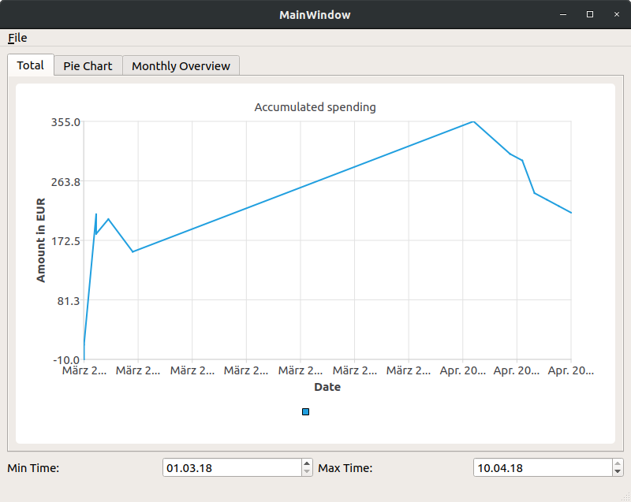
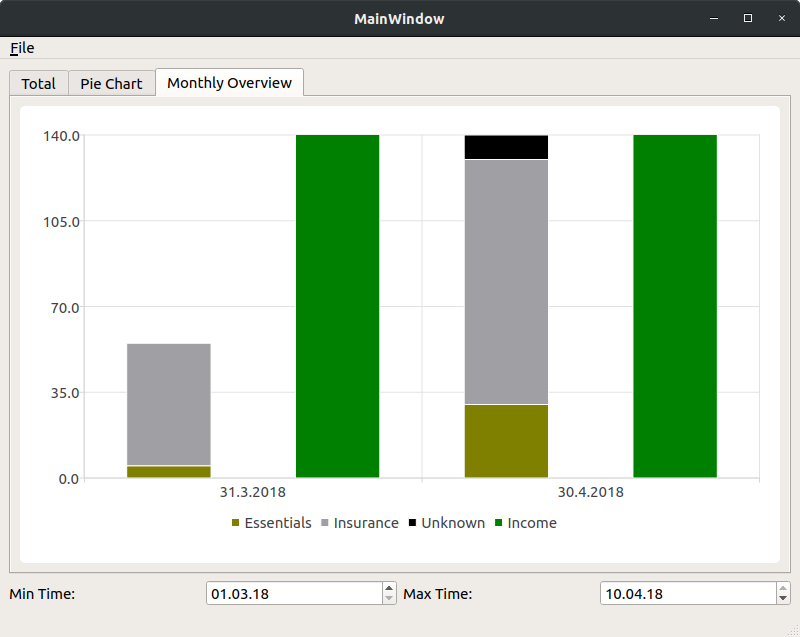
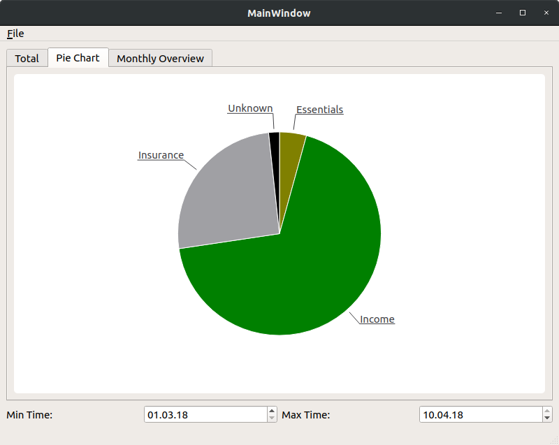
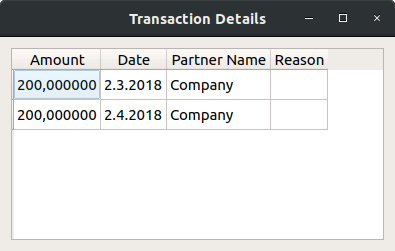
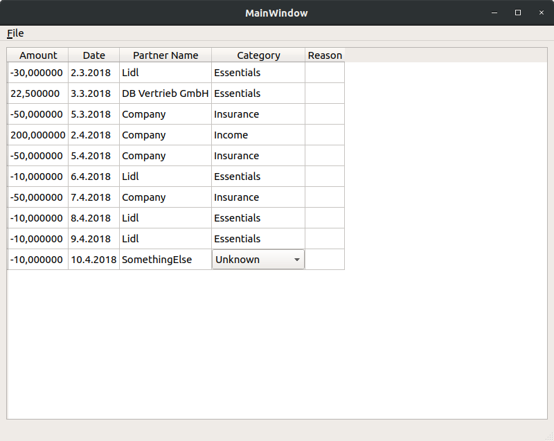

# Experiments with qt chart

To learn how to use qt, I wrote this small app. 

It shows an easy overview about finance data. 

The data is imported from statements of account.

Click to a bar or slice to show the details.

Usual transactions are sorted into categories according to the [category config](tracker/.category_config). Other transactions can be categorized with a few clicks: 

I removed some tests, because the effort to remove all private data was to high. 
Some parts of the code need some refactoring, but it does it job and I learned what I wanted to learn.
